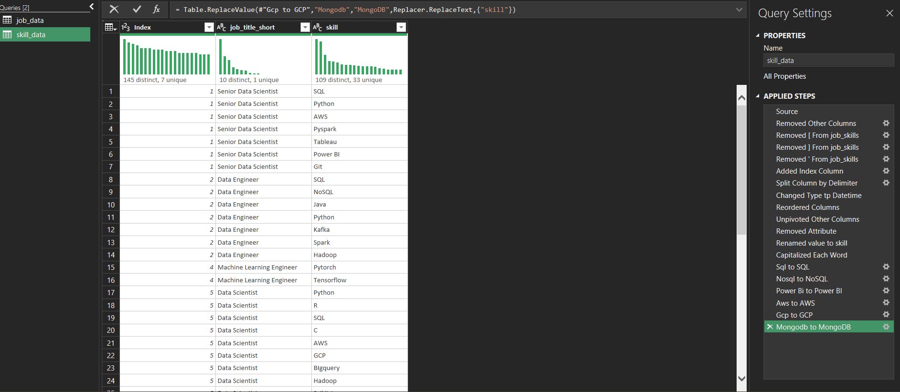
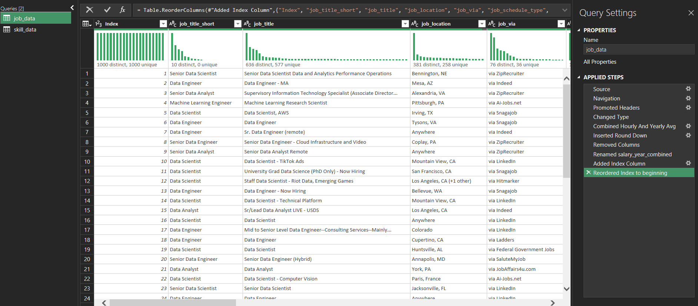

# 💼 Salary Filters Project – Excel Portfolio

This project explores the relationship between **technical skills** and **compensation** in data-related roles using **advanced Excel tools and features**. It replicates a real-world analytical workflow by leveraging **Power Query**, **Power Pivot**, **PivotTables**, and **Slicers** to clean, model, and visualize a large dataset of job listings.

---

## 📌 Project Overview

- **Goal:** Analyze how different technical skills influence salary levels in data-related job listings.  
- **Tools Used:** Power Query, Power Pivot, PivotTables, Slicers (all within Microsoft Excel).  
- **Dataset:** Provided in Luke Barousse’s [Excel for Data Analytics](https://www.youtube.com/watch?v=pCJ15nGFgVg&ab_channel=LukeBarousse) course, focused on data science job postings.  
- **Structure:** Modeled after Luke Barousse’s Salary Dashboard and Salary Analysis projects.  

---

## 🧹 1. Data Import and Preparation (Power Query)

- Imported raw data from **multiple sources** (CSV and Excel files) into a unified data model.  
- **Cleaned and transformed** data:  
  - Removed duplicates  
  - Standardized job titles  
  - Normalized salary fields  
  - Unified skill naming conventions  
- Created **helper tables** through table merging and calculated columns.  
- Loaded the cleaned data directly into the **Excel Data Model** for use in PivotTables and Power Pivot.

---

## 🧠 2. Data Modeling (Power Pivot)

- Established **relationships** between tables (e.g., jobs, skills, salaries) to enable multi-dimensional analysis.  
- Used Power Pivot to handle **large datasets** beyond Excel’s standard row limits.  
- Created **DAX measures** and calculated columns for:  
  - Median salary  
  - Skill ratios  
  - Salary-to-skill correlations  

---

## 📊 3. Analysis and Reporting (PivotTables)

Built multiple PivotTables for quick data exploration and reporting. Key insights included:

- 📍 **Median salary** by job title and region  
- 🔧 **Skill ratio:** Average number of skills required per job  
- 📈 Prevalence of technical skills across listings  
- 💸 Correlation between skill sets and salary levels  
---

## 🎛️ 4. Interactive Filtering (Slicers)

- Added **Slicers** for dynamic filtering across multiple PivotTables.  
- Enabled users to filter by:  
  - Job title  
  - Technical skill  
  - Region, and more  
- Created an **interactive dashboard** experience for technical and non-technical users alike.  

---

## 🔄 5. Easy Refresh & Maintenance

- The pipeline is built for **easy refresh**:  
  - New data → import with Power Query  
  - All linked PivotTables, visuals, and slicers update automatically  
- Scalable and adaptable as new job data is added.  

---

## 🛠️ Summary of Tools Used

| Tool           | Purpose                                                     |
|----------------|-------------------------------------------------------------|
| **Power Query**| Data import, cleaning, transformation, and model loading    |
| **Power Pivot**| Data modeling, DAX calculations, large dataset handling     |
| **PivotTables**| Data summarization and multi-dimensional analysis           |
| **Slicers**    | Interactive filtering and dashboard usability enhancements  |

---
## 📷 Screenshots From The Workbook

---
## 🎓 Based on Luke Barousse’s Course

- **Dataset:** Directly from Luke Barousse’s *Excel for Data Analytics* course  
- **Techniques Applied:**  
  - Formulas, tables, charts  
  - Power Query, Power Pivot  
  - DAX, PivotTables, Slicers  
- **Project Structure:** Modeled after the course’s portfolio projects:  
  - *Salary Dashboard*  
  - *Salary Analysis*  
- **Documentation Style:** In line with course recommendations for GitHub project sharing  
- **Learning Objective:** To apply and demonstrate every major concept taught in the course in a real-world scenario  

